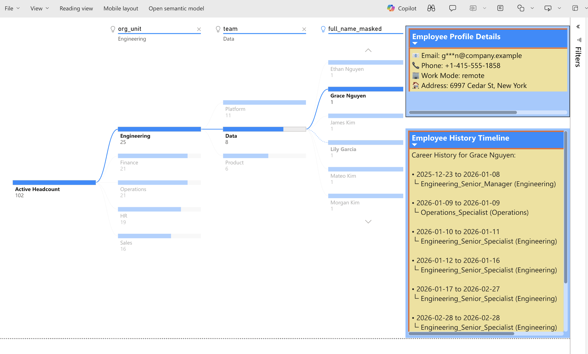
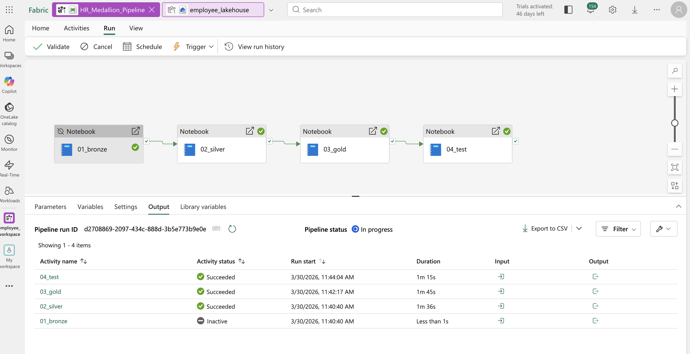
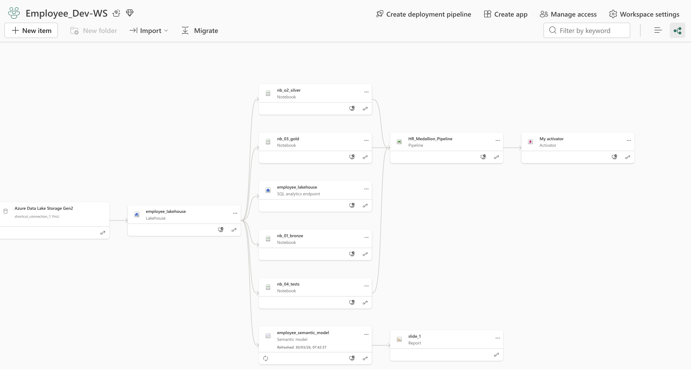

# Fabric HR Analytics & SCD2

Global Workforce & Org Dynamics Dashboard

> **Transform raw, daily HR snapshots into a time-traveling enterprise Data Model with Microsoft Fabric and Power BI.**

This project provides business leaders with dynamic, historical visibility into organizational hierarchies, headcount, and employee mobility while enforcing enterprise-grade data engineering patterns like Medallion Architecture and Slowly Changing Dimensions (SCD2).



---

## 📋 Table of Contents

* [Executive Overview](#-executive-overview)
* [Business Outcomes](#-business-outcomes)
* [Key Capabilities](#-key-capabilities)
* [Architecture](#️-architecture)
* [Quick Start](#-quick-start)
* [Project Structure](#-project-structure)
* [AI-Driven Development Approach](#-ai-driven-development-approach)
* [CI/CD & Automation](#-cicd--automation)

---

## 🎯 Executive Overview

This solution accelerates HR reporting by compressing massive, redundant daily employee snapshots into a clean, query-efficient history table. It delivers a scalable data foundation completely ready for "time-traveling" Power BI dashboards.

### Key Benefits

* ⚡ **Faster insights:** Completely automates the tracking of historical employee changes (promotions, department moves).
* 🎯 **Dynamic Org Charts:** Allows executives to visualize the exact corporate reporting structure on any specific date in history.
* 🔧 **Operational efficiency:** Built on a unified Fabric architecture—from PySpark Data Engineering to Power BI Semantic Models—with zero data movement.
* 🔒 **Enterprise governance:** Implements deterministic PII masking to protect sensitive employee data (Emails, Tax IDs) while maintaining analytical referential integrity.

---

## 💼 Business Outcomes

| Outcome                       | Impact                                                                                                  |
| ----------------------------- | ------------------------------------------------------------------------------------------------------- |
| **Historical Accuracy**       | Resolves double-counting errors by enforcing strict SCD2 Start/End date bounds and current-flag logic   |
| **Interactive "Time Travel"** | Provides business users a simple slider to instantly redraw charts based on historical states           |
| **Automated Compliance**      | PII is deterministically tokenized in the Silver layer, ensuring Gold layer dashboards are secure by default |
| **Seamless Scalability**      | Delta Lake tables natively handle daily incremental updates (`append` mode) without rebuilding history  |

---

## 🚀 Key Capabilities

### Data Integration

* **Medallion Architecture:** Strictly staged data processing (Bronze/Silver/Gold).
* **Advanced PySpark:** Uses complex Window functions (`F.lag`, `F.lead`) and cryptographic hashing (`F.sha2`) to detect row-level changes automatically.
* **Snowflake Schema Modeling:** Splits the Core Identity (Static Dim) from the Historical State (SCD2 Dim) to prevent ambiguous path errors in Power BI.

### Enterprise Features

* **Fabric-Native CI/CD:** Utilizes Fabric Deployment Pipelines for seamless Dev-to-Prod promotion.
* **Automated Data Quality Gates:** Automated PySpark testing to guarantee zero timeline overlaps or missing active records before data reaches Power BI.

---

## 🏗️ Architecture

### Medallion Architecture

This project implements the Medallion Architecture pattern:



#### Layer Details

* **Bronze Layer** (`nb_01_bronze.py`)  
   * Lands raw, daily HR CSV extracts.
   * Auto-detects schema and appends ingestion metadata (timestamps, source file names).
   * Supports both full historical backfills (`overwrite`) and daily delta loads (`append`).
* **Silver Layer** (`nb_02_silver.py`)  
   * Cleanses data and deduplicates identical daily records.
   * Computes a cryptographic "fingerprint" (`event_hash`) for every row to detect changes.
   * Applies deterministic masking to Emails and Tax IDs.
* **Gold Layer** (`nb_03_gold.py`)  
   * Compresses daily snapshots into a Slowly Changing Dimension Type 2 (`gold_dim_employee_scd2`).
   * Builds the Static Base Dimension (`gold_dim_employee_static`).
   * Generates analytical Fact tables for Daily Headcount, Reporting Lines, and Change Events.

---

## 🚀 Quick Start

### Prerequisites

* Microsoft Fabric workspace (F-SKU or Free Trial).
* Python 3.8+ (for local synthetic data generation).

### Installation

1. **Clone the repository**  
   ```bash
   git clone https://github.com/yinli113/fabric-hr-scd2.git  
   cd fabric-hr-scd2
   ```

2. **Generate the Synthetic Data**  
   ```bash
   python3 src/data_gen/generate_employee_data.py
   ```
   *(This creates a realistic `employee_hr_raw_extract_history.csv` file in your `data/raw/` folder).*

3. **Import to Fabric**  
   * Upload the generated CSV file directly to your Fabric Lakehouse `Files/` directory.
   * Create a new Fabric Notebook and import the code from `src/fabric/nb_01_bronze.py`.

4. **Run the ETL Pipeline in Order**  
   ```python
   # Execute in Fabric Notebooks sequentially:  
   run_nb_01(spark)  # 1. Bronze Ingestion  
   run_nb_02(spark)  # 2. Silver Transformation  
   run_nb_03(spark)  # 3. Gold Aggregation & SCD2  
   run_nb_04(spark)  # 4. Data Quality Validation
   ```

---

## 📁 Project Structure

```text
fabric-hr-scd2/
├── src/
│   ├── data_gen/                 # Python scripts to generate synthetic HR history
│   ├── fabric/                   # Core PySpark ETL Notebooks
│   │   ├── nb_01_bronze.py       # Raw ingestion & schema validation
│   │   ├── nb_02_silver.py       # PII masking & deduplication
│   │   ├── nb_03_gold.py         # SCD2 window functions & Fact creation
│   │   ├── nb_04_tests.py        # Automated data quality assertions
│   │   └── run_pipeline.py       # Orchestration wrapper
│   └── security/                 # Hashing and tokenization logic
├── docs/                         # Extended documentation
├── images/                       # Architecture diagrams
├── FABRIC_CICD_GUIDE.md          # CI/CD and deployment strategy
├── POWERBI_DASHBOARD.md          # DAX measures and Semantic Model setup
├── SCD2_README.md                # Deep-dive into the PySpark SCD2 logic
└── README.md                     # This file
```

---

## 🤖 AI-Driven Development Approach

This entire project was architected and built using advanced **AI Agents** (Cursor/Codex). Here is how the AI ecosystem powered the development:

1. **Agent Skills:** We utilized predefined `.cursor/skills` (e.g., `fabric-etl-silver-gold`, `medallion-architecture-fabric`, `deterministic-pii-masking`) to give the AI instant domain expertise. Instead of prompting the AI with basic Python instructions, the AI read these skill files to understand enterprise Fabric design patterns before writing a single line of code.
2. **Custom Rules:** Workspace rules controlled the AI's editing behavior, forcing it to follow a specific directory structure (`src/fabric/`) and prioritize in-place file editing over creating duplicate scripts.
3. **Subagents & Tool Calling:** The AI autonomously executed terminal commands, performed Python debugging, explored the local file system to auto-discover CSV schemas, and formatted Markdown documentation.
4. **Iterative Problem Solving:** When Fabric-specific errors occurred (e.g., `[SCHEMA_NOT_FOUND]` or `HTTP 430 Compute Limits`), the AI diagnosed the cloud infrastructure issues and provided immediate UI troubleshooting steps alongside the PySpark code fixes.

---

## 🔄 CI/CD & Automation



Even without external tools like GitHub Actions or Azure DevOps, this project implements a robust CI/CD lifecycle using Fabric's native Application Lifecycle Management (ALM) features.

### The Release Workflow

1. **Dev & Prod Isolation:** Dedicated `Employee_Dev_WS` and `Employee_Prod_WS` workspaces.
2. **Fabric Deployment Pipelines:** Used for 1-click promotion of Notebooks, Lakehouses, and Reports from Dev to Prod after passing the `nb_04_tests.py` validation gate.
3. **Automated Orchestration:** A Fabric Data Factory pipeline chains the notebooks together and uses a **Storage Event Trigger**. The moment a new daily HR CSV lands in the ADLS container, the pipeline automatically wakes up, ingests the data, recalculates the SCD2 history, and refreshes the Power BI dashboard.

*For full details on setting up this automation, see the [Fabric CI/CD Guide](FABRIC_CICD_GUIDE.md).*